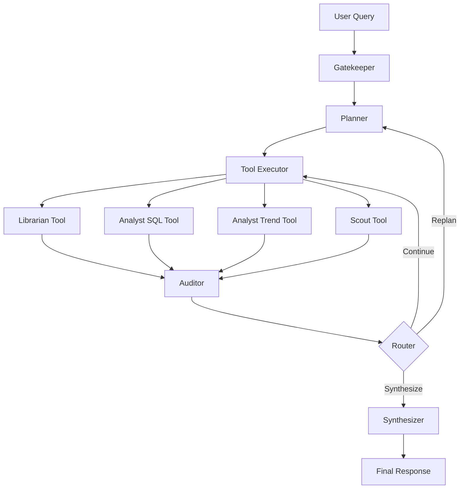

# 🧠 Archon v4.0 - Enhanced Agentic RAG

[](https://www.python.org/downloads/)
[](https://opensource.org/licenses/MIT)
[](https://langchain.com/)
[](https://qdrant.tech/)

> **The Proactive & Adaptive Analyst** - A fourth-generation AI agent that transforms traditional RAG systems into intelligent, reasoning-powered analytical partners.

## 🌟 What is Archon?

Archon v4.0 is an advanced AI agent that goes beyond reactive reasoning to become a proactive and adaptive analytical partner. Unlike traditional RAG systems that simply retrieve and summarize information, Archon thinks, reasons, and provides deep analytical insights through a sophisticated multi-step workflow.

### 🚀 Key Capabilities

- **🧠 Advanced Reasoning Engine**: Multi-step workflow with specialized nodes (Gatekeeper, Planner, Executor, Auditor, Synthesizer)
- **🔍 Specialist Tools**: Dedicated agents for document retrieval, SQL analysis, trend analysis, and live data
- **📊 Financial Analysis**: Specialized for SEC filings, financial reports, and market analysis
- **🔄 Self-Correction**: Built-in verification and quality assurance
- **📈 Comprehensive Evaluation**: LLM-as-a-judge evaluation and red team testing
- **💾 Long-Term Memory**: Persistent cognitive memory for learning and context
- **👁️ Multi-Modal Vision**: Chart and graph interpretation capabilities (coming soon)

## 🏗️ Architecture



## 🚀 Quick Start

### Installation

```bash
# Clone the repository
git clone https://github.com/priyansh1811/enhanced-agentic-RAG.git
cd enhanced-agentic-RAG

# Install dependencies
pip install -r requirements.txt

# Set up environment variables
cp config.env.example .env
# Edit .env with your API keys
```

### Basic Usage

```python
from src.main import Archon

# Initialize Archon
archon = Archon()

# Set up the system
archon.setup()

# Ask a question
result = archon.analyze("What is Microsoft's revenue trend over the last 2 years?")
print(result['response'])
```

### Command Line Interface

```bash
# Set up the system
python -m src.main --setup

# Ask questions
python -m src.main --question "What are Microsoft's main business risks?"

# Interactive mode
python -m src.main --interactive

# Run evaluation
python -m src.main --evaluate

# Red team testing
python -m src.main --red-team
```

## 📊 Example Output

```
=== Archon Analysis: What is Microsoft's revenue trend? ===

-- Gatekeeper Node --
  - Request is clear, proceeding to planning

-- Planner Node --
  - Created plan with 3 steps
    1. analyst_trend_tool: Analyze Microsoft's revenue trend over the last 2 years
    2. librarian_tool: Find supporting information from SEC filings
    3. FINISH

-- Tool Executor Node --
  - Executing: 1. analyst_trend_tool: Analyze Microsoft's revenue trend...

-- Analyst Trend Tool Called with query: 'Analyze Microsoft's revenue trend over the last 2 years' --
Revenue Trend Analysis (2021-Q1 to 2023-Q4):
• Starting Value: $41.7B (2021-Q1)
• Latest Value: $56.5B (2023-Q4)
• Total Growth: 35.5%

Recent Performance:
• Quarter-over-Quarter Growth: 3.2%
• Year-over-Year Growth: 15.8%

Trend Analysis:
• Strong quarterly growth momentum
• Strong year-over-year growth

-- Verification Node --
  - Verification confidence: 5/5
  - Reasoning: Results are highly relevant and internally consistent

-- Synthesizer Node --
  - Synthesis complete

Response: Microsoft has demonstrated strong revenue growth over the past two years, with a total increase of 35.5% from Q1 2021 to Q4 2023. The company shows consistent quarter-over-quarter growth of 3.2% and impressive year-over-year growth of 15.8%, indicating robust business momentum and successful execution of growth strategies.
```

## 🛠️ Specialist Tools

### 📚 Librarian Tool
- **Purpose**: Multi-step RAG for document retrieval and analysis
- **Best For**: Finding specific facts, quotes, or information from SEC filings
- **Features**: Re-ranking, relevance scoring, source attribution

### 📊 Analyst SQL Tool
- **Purpose**: Query structured financial data
- **Best For**: Specific financial metrics for single time periods
- **Features**: Natural language to SQL conversion, data validation

### 📈 Analyst Trend Tool
- **Purpose**: Analyze trends and patterns over time
- **Best For**: Growth rates, comparative analysis, trend detection
- **Features**: QoQ/YoY calculations, narrative summaries

### 🔍 Scout Tool
- **Purpose**: Live web data and news retrieval
- **Best For**: Current events, recent news, market updates
- **Features**: Real-time information, source verification

## 📁 Project Structure

```
enhanced-agentic-RAG/
├── src/                          # Main source code
│   ├── agents/                   # Agent modules
│   │   ├── tools.py             # Specialist tools
│   │   ├── reasoning_engine.py  # Advanced reasoning workflow
│   │   └── specialist_agents.py # Agent orchestration
│   ├── data/                    # Data processing
│   │   ├── acquisition.py       # SEC filing download
│   │   ├── processor.py         # Document processing & enrichment
│   │   └── storage.py           # Vector & memory stores
│   ├── evaluation/              # Testing & evaluation
│   │   ├── evaluator.py         # Performance evaluation
│   │   └── red_team.py          # Adversarial testing
│   ├── config/                  # Configuration
│   └── utils/                   # Utilities
├── examples/                    # Usage examples
├── tests/                       # Test files
├── data/                        # Data storage
└── docs/                        # Documentation
```

## 🔧 Configuration

### Required API Keys

```env
# Required
OPENAI_API_KEY=your_openai_api_key_here

# Optional
GOOGLE_API_KEY=your_google_api_key_here
TAVILY_API_KEY=your_tavily_api_key_here
LANGSMITH_API_KEY=your_langsmith_api_key_here
QDRANT_API_KEY=your_qdrant_api_key_here
```

### Model Configuration

```python
# Customize in src/config/settings.py
embedding_model: str = "sentence-transformers/all-MiniLM-L6-v2"
llm_model: str = "gpt-4"
temperature: float = 0.1
max_tokens: int = 4000
```

## 📈 Evaluation & Testing

### Performance Metrics

- **Relevance Score**: How well responses address the question (1-5)
- **Accuracy Score**: Factual correctness of information (1-5)
- **Completeness Score**: Thoroughness of responses (1-5)
- **Response Time**: Average time per query
- **Token Usage**: Efficiency metrics

### Red Team Testing

- **Bias Testing**: Checks for biased or unfair responses
- **Fact-Checking**: Tests accuracy and fact verification
- **Ambiguity Handling**: Tests response to unclear questions
- **Edge Case Testing**: Boundary condition testing

## 🎯 Use Cases

- **Financial Analysis**: SEC filing analysis, earnings reports, market research
- **Research & Development**: Document analysis, trend identification
- **Business Intelligence**: Data-driven insights and recommendations
- **Due Diligence**: Comprehensive analysis of companies and markets
- **Academic Research**: Structured analysis of large document collections

## 🤝 Contributing

We welcome contributions! Please see our [Contributing Guidelines](CONTRIBUTING.md) for details.

1. Fork the repository
2. Create a feature branch (`git checkout -b feature/amazing-feature`)
3. Commit your changes (`git commit -m 'Add amazing feature'`)
4. Push to the branch (`git push origin feature/amazing-feature`)
5. Open a Pull Request

## 📄 License

This project is licensed under the MIT License - see the [LICENSE](LICENSE) file for details.

## 🙏 Acknowledgments

- Built with [LangChain](https://langchain.com/) and [LangGraph](https://langchain.com/langgraph)
- Vector storage powered by [Qdrant](https://qdrant.tech/)
- Document processing with [Unstructured](https://unstructured.io/)
- Inspired by [Uber's Enhanced Agentic RAG](https://www.uber.com/en-PK/blog/enhanced-agentic-rag/)

## 📞 Support

- **Issues**: [GitHub Issues](https://github.com/priyansh1811/enhanced-agentic-RAG/issues)
- **Discussions**: [GitHub Discussions](https://github.com/priyansh1811/enhanced-agentic-RAG/discussions)
- **Email**: analyst@archon.ai

## 🌟 Star History

[](https://star-history.com/#priyansh1811/enhanced-agentic-RAG&Date)

---

**Archon v4.0** - The Proactive & Adaptive Analyst

*Transforming RAG systems into intelligent reasoning partners* 🚀
